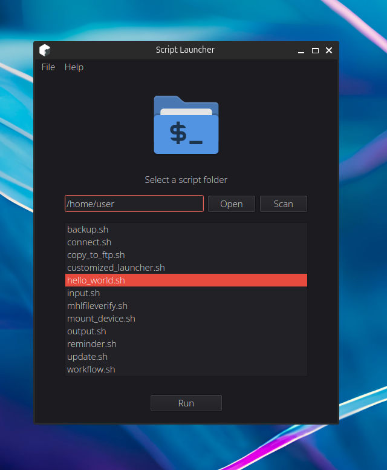

# ScriptLauncherQT

ScriptLauncherQT for Linux is a simple tool written in Python and pySide to launch scripts quickly from a GUI.

## Features

- Launch bash scripts into a folder from a GUI
- Cross distribution and terminals
- Scan a chosen folder
- Store a default folder
- Launch

## System requeriments

- Python3
- Pyside6
- GLIB 2.28 (in AppImage versions)

## Instructions

The project folder structure is following the Appimage AppDir conventions. However, if you prefer launch from script, you can invoke /usr/src/ScriptLauncher.py directly from python.

## Appimage version

This app is distributed as an Appimage format. It has been tested on Ubuntu 20.04, Linux Mint, MxLinux and Rocky Linux 8 / 9. Older versións couldn't work due to GLIB version. However, you could make it work from source code if you install Pyside6.

You can download AppImage versions from [releases](https://github.com/batikstudio/ScriptLauncher/releases).

## Known Issues

- Only a selection of most common terminals are supported.

## Changelog

#### v0.3

- First public version
- Added terminal detection in order to maximize compatibility across the different distributions
- Added a logo and icons to actions

#### v0.2

- Pyside6 GUI migration

- To store a default dir to search scripts

#### v0.1

- Initial Tkinter GUI design

[BatikStudio](https://batikstudio.com) Home Page
